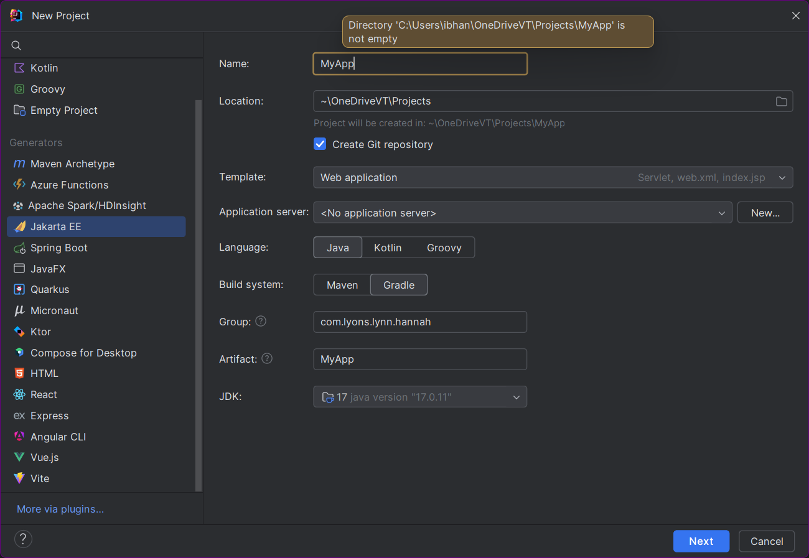
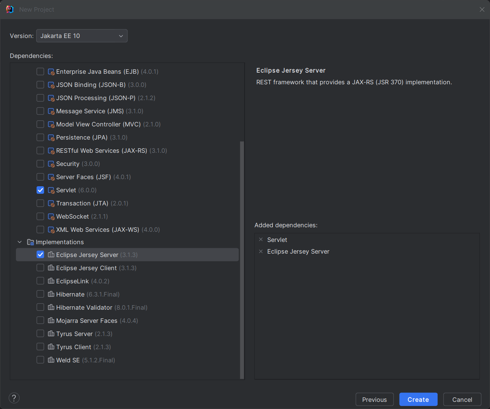
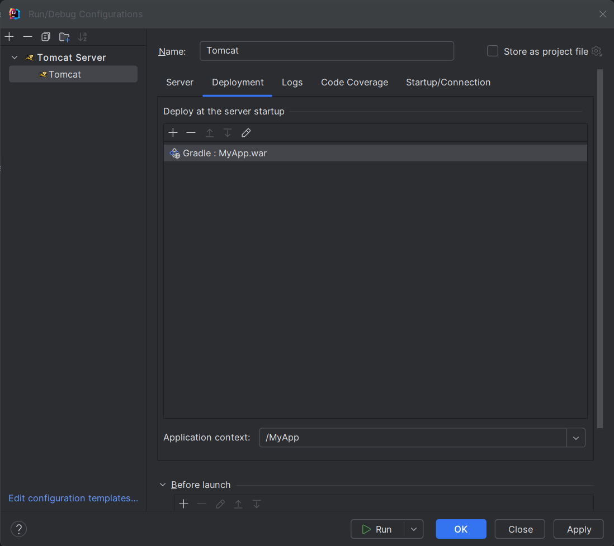
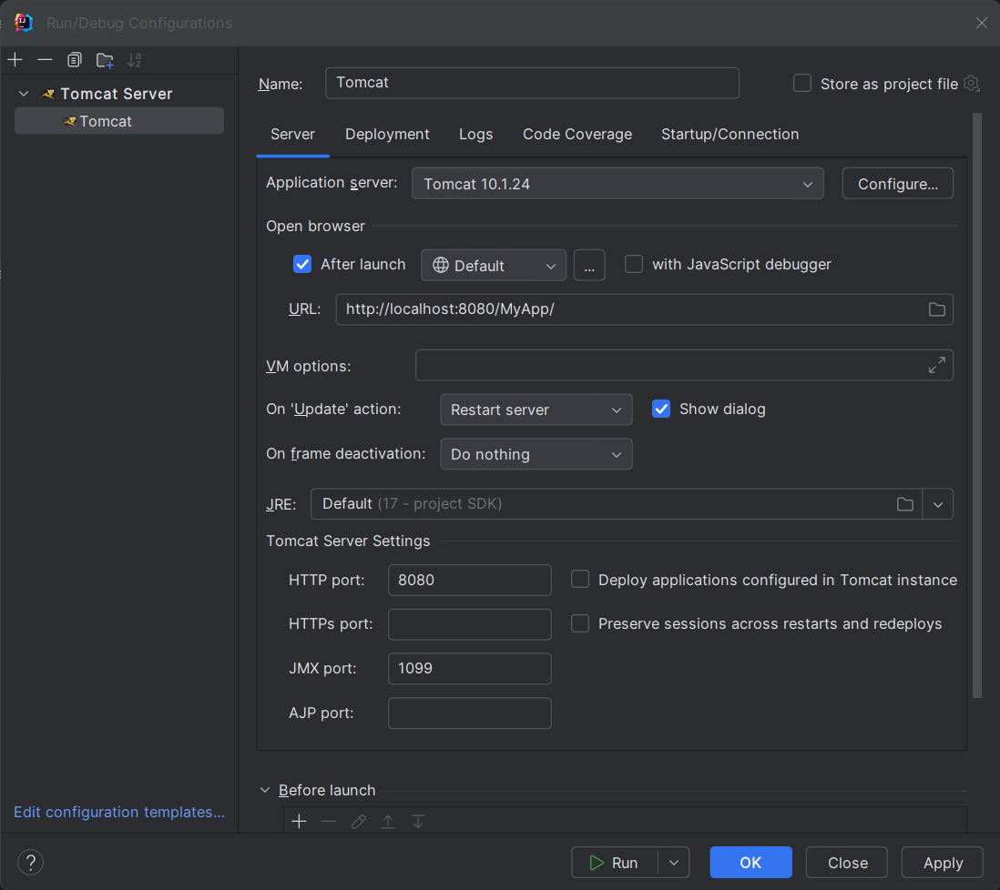

Creating and deploying a full-stack web application with the specified technologies and utilizing GitOps methodology involves several steps. Here's a detailed guide:

### **1. Set Up the Development Environment**

#### **1.1. Frontend (React + TypeScript + Vite)**
   - **Install Node.js and npm**: Ensure you have Node.js installed. Vite requires at least Node.js 12.
   - **Create a Vite Project**:
     ```bash
     npm create vite@latest my-app --template react-ts
     cd my-app
     npm install
     npm run dev
     ```
   - **Develop Your React App**: Build your frontend using React components with TypeScript.

### **Updated Steps for Jakarta EE Project Using Jakarta, Gradle, Servlet Specification, and Eclipse Jersey Server**

#### **1.2. Backend (Java Jakarta EE with Web Application Template)**

##### **1.2.1. Set Up Your Jakarta EE Project**
   - **Create a New Project in Your IDE (IntelliJ)**:
     - Create a new Jakarta EE project.
     - 
     - Select the **Servlet specification** and **Eclipse Jersey Server** as the REST framework.
     - 

##### **1.2.2. Configure `build.gradle`**
   - Update your `build.gradle` to remove 
   ```gradle
    group 'com.example'
    version '1.0-SNAPSHOT'
   ```

##### **1.2.3. Create a Run Configuration for the Server**
   - Edit Run Congiuration
   - Create Local Tomcat Server
   - 
   - 
     

##### **1.2.4. Database Integration**
   - **Add MySQL JDBC Driver**:
     - The MySQL JDBC driver is already included in the `build.gradle` file.

   - **Database Configuration in `web.xml`**:
     - Add your MySQL database configuration, or manage it via context parameters:
     ```xml
     <resource-ref>
         <description>MySQL Database Connection</description>
         <res-ref-name>jdbc/MyDB</res-ref-name>
         <res-type>javax.sql.DataSource</res-type>
         <res-auth>Container</res-auth>
     </resource-ref>
     ```

   - Alternatively, define your DataSource directly in `context.xml`.

##### **1.2.5. Build and Package**
   - **Build Your Project**:
     - Use Gradle to build your project and package it as a `.war` file:
     ```bash
     gradle clean build
     ```

### **2. Dockerize Your Application**

#### **2.2. Backend Dockerfile**
   - Update the Dockerfile to include the `.war` file for deployment:
   ```dockerfile
   FROM tomcat:10.1.24-jdk17
   COPY build/libs/your-app.war /usr/local/tomcat/webapps/
   EXPOSE 8080
   CMD ["catalina.sh", "run"]
   ```

### **2. Dockerize Your Application**

#### **2.1. Frontend Dockerfile**
   - Create a `Dockerfile` in your React project:
     ```dockerfile
     FROM node:18-alpine AS build
     WORKDIR /app
     COPY . .
     RUN npm install
     RUN npm run build

     FROM nginx:alpine
     COPY --from=build /app/dist /usr/share/nginx/html
     EXPOSE 80
     CMD ["nginx", "-g", "daemon off;"]
     ```

#### **2.2. Backend Dockerfile**
   - Create a `Dockerfile` for your Java project:
     ```dockerfile
     FROM tomcat:10.1.24-jdk17
     COPY target/your-app.war /usr/local/tomcat/webapps/
     EXPOSE 8080
     CMD ["catalina.sh", "run"]
     ```

#### **2.3. MySQL Dockerfile**
   - Use the official MySQL image in your `docker-compose.yml`:
     ```yaml
     version: '3.8'
     services:
       mysql:
         image: mysql:8.0
         environment:
           MYSQL_DATABASE: mydatabase
           MYSQL_USER: myuser
           MYSQL_PASSWORD: mypassword
           MYSQL_ROOT_PASSWORD: rootpassword
         ports:
           - "3306:3306"
         volumes:
           - my-db:/var/lib/mysql
     volumes:
       my-db:
     ```

### **3. Set Up Kubernetes**

#### **3.1. Create Kubernetes Manifests**
   - **Frontend Deployment & Service**:
     ```yaml
     apiVersion: apps/v1
     kind: Deployment
     metadata:
       name: frontend
     spec:
       replicas: 2
       selector:
         matchLabels:
           app: frontend
       template:
         metadata:
           labels:
             app: frontend
         spec:
           containers:
           - name: frontend
             image: your-frontend-image
             ports:
             - containerPort: 80
     ---
     apiVersion: v1
     kind: Service
     metadata:
       name: frontend
     spec:
       selector:
         app: frontend
       ports:
         - protocol: TCP
           port: 80
           targetPort: 80
       type: LoadBalancer
     ```

   - **Backend Deployment & Service**:
     ```yaml
     apiVersion: apps/v1
     kind: Deployment
     metadata:
       name: backend
     spec:
       replicas: 2
       selector:
         matchLabels:
           app: backend
       template:
         metadata:
           labels:
             app: backend
         spec:
           containers:
           - name: backend
             image: your-backend-image
             ports:
             - containerPort: 8080
     ---
     apiVersion: v1
     kind: Service
     metadata:
       name: backend
     spec:
       selector:
         app: backend
       ports:
         - protocol: TCP
           port: 8080
           targetPort: 8080
       type: ClusterIP
     ```

   - **MySQL Deployment & Service**:
     ```yaml
     apiVersion: apps/v1
     kind: Deployment
     metadata:
       name: mysql
     spec:
       selector:
         matchLabels:
           app: mysql
       template:
         metadata:
           labels:
             app: mysql
         spec:
           containers:
           - name: mysql
             image: mysql:8.0
             env:
             - name: MYSQL_ROOT_PASSWORD
               value: rootpassword
             - name: MYSQL_DATABASE
               value: mydatabase
             - name: MYSQL_USER
               value: myuser
             - name: MYSQL_PASSWORD
               value: mypassword
             ports:
             - containerPort: 3306
               name: mysql
     ---
     apiVersion: v1
     kind: Service
     metadata:
       name: mysql
     spec:
       ports:
         - port: 3306
       selector:
         app: mysql
     ```

#### **3.2. Deploy to Kubernetes**
   - Use `kubectl` to deploy your manifests:
     ```bash
     kubectl apply -f frontend-deployment.yaml
     kubectl apply -f backend-deployment.yaml
     kubectl apply -f mysql-deployment.yaml
     ```

### **4. Set Up GitHub Actions for CI/CD**

#### **4.1. GitHub Repository Structure**
   - Push your code to a GitHub repository with the following structure:
     ```
     frontend/
     backend/
     k8s/
     .github/workflows/
     ```

#### **4.2. GitHub Actions Workflow**
   - Create a `.github/workflows/deploy.yml`:
     ```yaml
     name: CI/CD Pipeline

     on:
       push:
         branches:
           - main

     jobs:
       build-and-deploy:
         runs-on: ubuntu-latest

         steps:
         - name: Checkout code
           uses: actions/checkout@v3

         - name: Set up Node.js
           uses: actions/setup-node@v3
           with:
             node-version: '18'

         - name: Build frontend
           run: |
             cd frontend
             npm install
             npm run build

         - name: Build Docker images
           run: |
             docker build -t your-dockerhub-username/frontend:latest ./frontend
             docker build -t your-dockerhub-username/backend:latest ./backend
             docker push your-dockerhub-username/frontend:latest
             docker push your-dockerhub-username/backend:latest

         - name: Deploy to Kubernetes
           run: |
             kubectl apply -f ./k8s/frontend-deployment.yaml
             kubectl apply -f ./k8s/backend-deployment.yaml
             kubectl apply -f ./k8s/mysql-deployment.yaml
     ```

### **5. Set Up AWS Infrastructure**

#### **5.1. Set Up EKS (Elastic Kubernetes Service)**
   - **Create an EKS Cluster**:
     - Use the AWS Management Console or CLI to create an EKS cluster.
     - Configure your `kubectl` to interact with your EKS cluster.

#### **5.2. Set Up RDS (Relational Database Service) for MySQL**
   - **Create a MySQL Database Instance**:
     - Use the RDS service in AWS to create a MySQL instance.
     - Configure your Jakarta EE application to connect to this instance.

#### **5.3. Set Up S3 for Frontend Hosting (Optional)**
   - **Create an S3 Bucket**:
     - If you prefer, host the static files of your React app on S3 with CloudFront for CDN.

### **6. Deploy and Monitor**

#### **6.1. Push Your Code**
   - Push your code to GitHub. This will trigger the GitHub Actions workflow.
   - The CI/CD pipeline will build Docker images, push them to DockerHub, and deploy the application to your EKS cluster.

#### **6.2. Monitor and Test**
   - Use AWS CloudWatch for logging and monitoring.
   - Test your deployed application using the public IP or DNS provided by AWS.

By following these steps, you will have a fully functional web application deployed on

 AWS, with continuous integration and deployment set up using GitHub Actions, Docker, and Kubernetes. This setup adheres to the GitOps methodology, ensuring that your infrastructure and application code are version-controlled and automatically deployed.